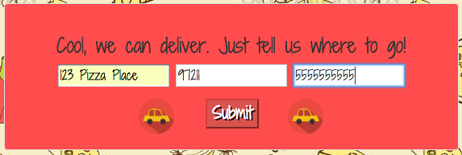

# _Pizza Website_

#### _Fourth Independent Project (JS) for Intro at Epicodus, 06.16.2017_

#### By _Calla Rudolph_ [(e-mail me here)](<mailto:callarudolph@gmail.com>)

## Description

_This project utilizes objects with constructors and prototypes within JavaScript. The user will choose selections to order a pizza, and the prototypes will display the user's order as well as calculate the user's total. Additional buttons allow for multiple orders as well as a delivery option._


_Splash page_


_Order confirmation_


_Delivery form_


_Delivery confirmation_


## Specifications

* It calculates a total amount and displays back the user's name and order when the Total button is clicked.
  * Example Input: Large: $12 (size), Pepperoni: $3 (meat), Extra Cheese: $5 (topping), Emily (name)
  * Example Output: 'Emily, you ordered a large pizza with pepperoni and extra cheese. Your total is $20.'
* It allows the user to enter a delivery address and displays back the Street Address and Phone Number when the Submit button is clicked.
  * Example Input: 123 C Street (street address), 97211 (zip code), 888.888.8888 (phone number)
  * Example Output: 'We'll head over to 123 C Street when your order is ready. We will call 888.888.8888 if we get lost.'


## Setup/Installation Requirements

* Open GitHub site on your browser: https://github.com/CallaRudolph/Pizza-Website
* Select the dropdown (green box) "Clone or download"
* Copy the link for the GitHub repository
* Open Terminal on your computer and perform the following steps:
````
  * $ cd desktop
  * $ git clone <paste repository link>
  * $ cd Pizza-Website
  * $ open index.html
````
* Input an order to get started!

## Support and contact details

If you run into any findings, please email me at the address above!

## Technologies Used

* HTML
* CSS
* Bootstrap
* JavaScript
* jquery

### License

_This software is licensed under the MIT license._

Copyright (c) 2017 **_Calla Rudolph_**
